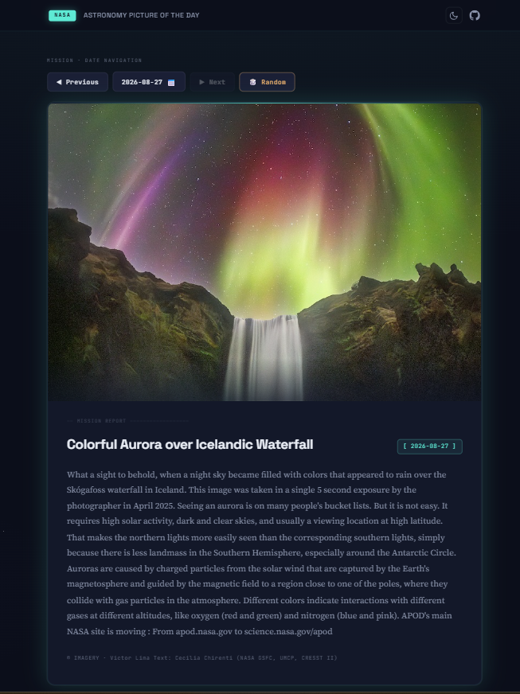
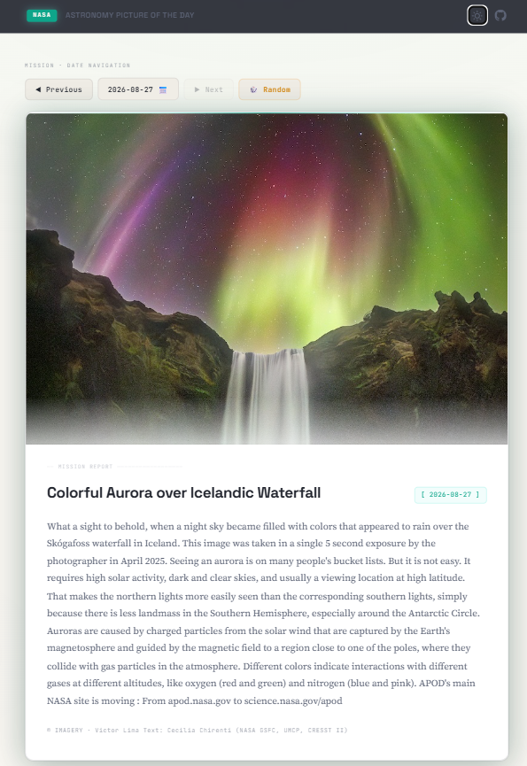

# NASA Astronomy Picture of the Day (APOD) Dashboard

A sleek, space-mission-inspired web dashboard for exploring daily cosmic photography, video broadcasts, scientific explanations, and archival deep-space imagery from NASA.

🔗 **Live Demo**: [https://live-data-dashboard-rho.vercel.app/](https://live-data-dashboard-rho.vercel.app/)

---

### Dark Mode


### Light Mode


---

## ✨ Features

- **Live NASA APOD Data**: Real-time integration with NASA's Astronomy Picture of the Day API, rendering high-resolution imagery and video embeds with full scientific explanations and metadata.
- **Date Navigation**: Easily travel through space history back to APOD's inception on June 16, 1995:
  - **Previous / Next Day**: Step chronologically through daily discoveries.
  - **Random Date**: Roll the dice (`🎲 Random`) to discover serendipitous captures.
  - **Custom Multi-Tier Calendar**: Jump to any specific date with an interactive day/month/year selector.
- **Image Lightbox**: Fullscreen modal viewer with high-resolution image rendering (`hdurl`), keyboard accessibility (`Escape` key), and backdrop dismiss.
- **Light / Dark Theme Toggle**: Handcrafted dual-mode color schemes powered by CSS variables with zero-flash load persistence via `localStorage`.
- **Secure API Key Handling**: Serverless backend proxy (`/api/apod.js`) running on Vercel to safely hide the NASA API key from client-side network inspection and prevent key exposure.

---

## 🛠️ Tech Stack

- **Frontend**: Vanilla HTML5, Vanilla CSS3 (Custom Properties & Design Tokens), Vanilla JavaScript (ES6+ async/await, DOM APIs, MutationObserver)
- **Data Source**: NASA APOD API (`https://api.nasa.gov/planetary/apod`)
- **Backend / Security**: Vercel Serverless Functions (Node.js runtime for environment-variable-backed API proxying)
- **Deployment**: Vercel

---

## 🧠 What I Learned

Building this project provided hands-on experience in building performant, production-ready frontend interfaces and managing secure client-server architectures:

- **The Full Fetch / Render Lifecycle**: I deepened my understanding of handling asynchronous lifecycles in vanilla JavaScript. This included implementing smooth skeleton loading states to avoid layout shifts, managing error recovery gracefully when network requests fail, and adapting the UI dynamically for both raster images and embedded video frames.
- **Proper API Key Security & Serverless Architecture**: Initially, the NASA API key was stored in a client-accessible configuration file. After realizing that any secret bundled on the frontend is publicly exposed to network scrapers, I restructured the architecture. I implemented a serverless proxy function (`/api/apod.js`) on Vercel that reads `process.env.NASA_API_KEY` on the server and forwards requests to NASA safely without leaking credentials to the client.
- **Building Bespoke Custom UI Components**: Instead of settling for native browser controls like `<input type="date">` (which render inconsistently across operating systems and browsers), I designed and engineered a custom datepicker dropdown with multi-level year, month, and day drill-down views, strict boundary clamping (1995 to today), and ARIA accessibility. I also built a lightweight lightbox modal with scroll locking and focus management.
- **Dynamic Theming with CSS Custom Properties**: I learned how to structure design tokens using CSS variables to seamlessly toggle between a deep cosmic dark theme and an editorial light theme. By placing a small blocking script before first paint, I eliminated Flash of Unstyled Content (FOUC) while keeping user theme preferences synced in `localStorage`.

---

## 🚀 Running Locally

Follow these steps to run the dashboard on your local machine:

### 1. Clone the repository
```bash
git clone https://github.com/DushyantSingh7120/Live-Data-Dashboard.git
cd Live-Data-Dashboard
```

### 2. Set up environment variables
To test the serverless function locally or deploy to Vercel, obtain a free NASA API key from [api.nasa.gov](https://api.nasa.gov/).

Create a `.env` file in the root directory:
```env
NASA_API_KEY=your_actual_api_key_here
```

### 3. Run a local server

**Option A: Using Vercel CLI (Recommended for testing the `/api/apod` serverless function)**
```bash
npx vercel dev
```

**Option B: Using a static server (for frontend testing)**
```bash
npx serve . -l 8000
```
Then open your browser and navigate to `http://localhost:8000` (or the port indicated in your terminal).
